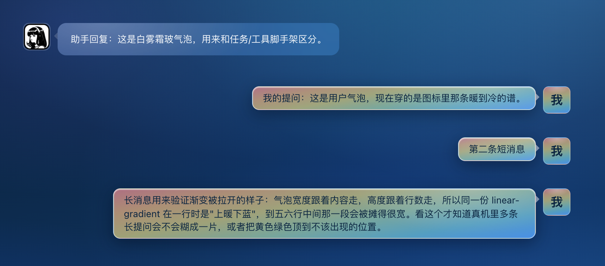
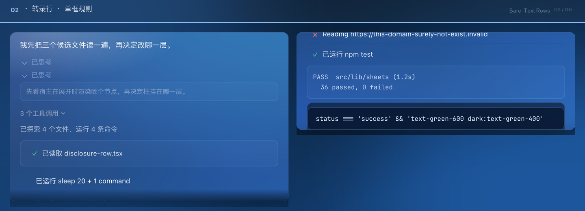
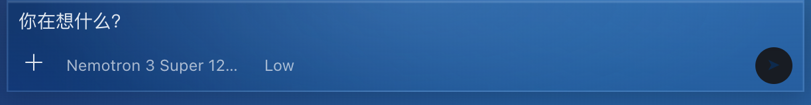
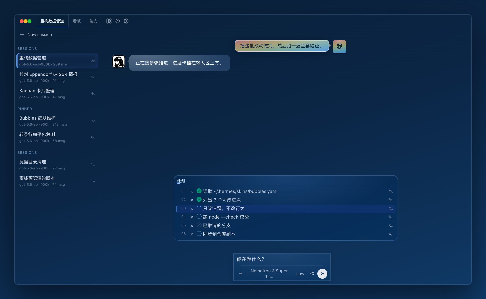
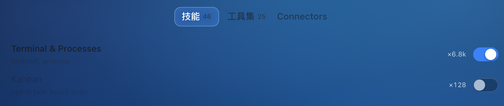
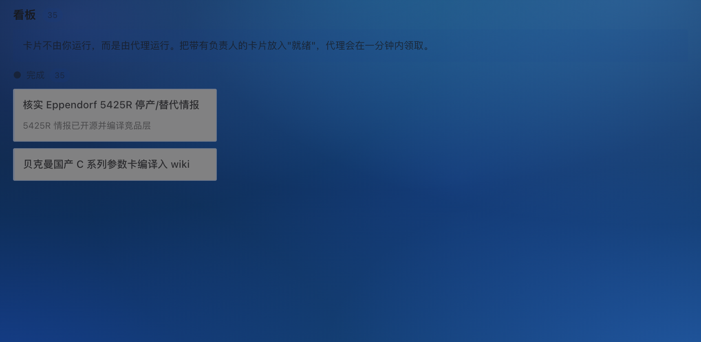

# Hermes Bubbles Blue Glass Skin & Theme

[](https://opensource.org/licenses/MIT)
[](https://github.com/NousResearch/hermes-agent)
[](https://github.com/AproXin/hermes-bubbles-skin/actions/workflows/verify.yml)

A full-window blue glassmorphism **skin** for [Hermes Agent](https://github.com/NousResearch/hermes-agent) Desktop, paired with a **desktop plugin** that restructures the transcript, composer and task surfaces the skin alone cannot reach.

This repo is the canonical source of both halves. `scripts/sync.js` deploys them to a local Hermes install.

<p align="center">
  <meta property="og:image" content="https://raw.githubusercontent.com/AproXin/hermes-bubbles-skin/main/docs/previews/social-preview.png">
  <meta property="og:title" content="Hermes Bubbles — Blue Glass Skin for Hermes Agent Desktop">
  <meta property="og:description" content="A full-window blue glassmorphism skin for Hermes Agent Desktop, paired with a desktop plugin that restructures the transcript, composer and task surfaces.">
</p>



---

## 界面预览

下面每张图都是一个完整的窗口，展示方式参照 [`FPSUnleashed/hermes-codex-skin`](https://github.com/FPSUnleashed/hermes-codex-skin)：没有外框，没有标题条，也不裁成卡片，就是应用本身。窗框、标签条和会话行照抄宿主源码（`session-row.tsx:375` 的行壳、`pane-tab.tsx` 的标签、`ui/sidebar.tsx` 的根），渲染由 `scripts/render-preview.js` 负责——叠「构建 CSS + live customCSS + PLUGIN_CSS」三层真实样式表离线出图，脚本还会补上 ThemeProvider 运行时才写进 `<html>` 的主题种子变量（`--theme-foreground` / `-primary` / `-midground` / `*-seed`），所以配色跟真机一致。截图里的文字都是夹具占位符。唯一的失真在 codicon 字形上，离线不一定解析出来。重出这批图：

```bash
node scripts/render-preview.js
```

### 1. 气泡与氛围底板 (Frosted Glass Bubbles & Ambient Lighting)
深邃黑曜石蓝玻璃 + 6 重环境光斑；白雾霜玻 AI 气泡，用户气泡穿暖→冷光谱，头像同样是 CSS 画的。


### 2. 转录行 (Bare-Text Rows & One Frame Rule)
收起时是裸文本，展开才有一个发丝线框，标题永远落在框外。



### 3. Composer
输入主体在上，1px 低对比分隔线在下，下方一行工具栏。



### 4. 任务进度卡 (Tasks)
一张圆角卡、编号行、标题分隔线上跑进度条、正文独立滚动。



### 5. 技能 / 工具集页 (Capabilities)
开关两态可读，分类标签选中态加强。



### 6. 看板 (Kanban)
页面背景走主题变量，环境光透出来。



---

## 视觉特性

### 皮肤层（`bubbles.yaml`）

6 层 `radial-gradient` 光斑铺在 `linear-gradient(165deg, #092038, #0e2e54, #16467d)` 的黑曜石蓝底板上，这是整块「氛围」的来源。

气泡有两种。助手气泡是白雾霜玻 `rgba(255, 255, 255, 0.13)` 加顶部白色高光，`min-height: 38px`；用户气泡穿一条暖→冷光谱渐变（`#F1594B → #EC8F32 → #D4B236 → #8FB66F → #4EA8B0 → #398DF6`，各 0.55 alpha）压在 `rgba(147, 197, 253, 0.62)` 上，配 `blur(16px) saturate(1.4)`、深色字 `#0a2440`，高度收在 30px。

停止与复原按钮从气泡里挪到了左侧垂直居中，不再和正文抢位置；语音入口保持高对比，一眼能看到。

终端各层平涂 `--ui-terminal-surface-background`，不再被环境光斑规则覆盖，右侧 rail 仍保留光斑。

### 插件层（`src/plugin.js`）

已思考、已运行、已读取这些行不画卡片，状态交给文字颜色和字形承担——running 转圈、completed 打勾、failed 打叉。只有代码块与 diff 还留着强调框。

展开才有框：收起时无框，展开时一个发丝线圆角框，标题永远在框外。组内再展开的明细降一级，改用左侧竖线；单独一个工具的 run 没有外层汇总，保留完整框。`[data-delegate-card]` 和 agents 树节点走的是同一套发丝线质感。

连续完成的工具会折成一行安静摘要（`▸ 3 个工具调用`），点开看完整执行日志。折叠只折叠，不删节点——原始 DOM 一个都不少。

用户消息超过 4 行自动折叠，配 Show more / Show less 胶囊，Markdown 与代码块完整保留。

Composer 按 Codex 的排法：输入主体在上，一条 1px 低对比分隔线（左右内缩、再淡一档）在下，分隔线下面是一行工具栏。模型、推理强度、附件靠左，语音靠右，同一基线垂直居中。

任务区的状态栈只有一张圆角蓝宝石卡（归属 `[data-bubbles-task-section]`），编号行、标题分隔线上跑进度条、正文独立滚动。

技能 / 工具集页的开关与页面其它开关同尺寸、同动效、同配色，选中态可读；分类标签选中态加强，填充 + 发丝描边 + 内发光。

看板页背景走主题变量（`--ui-surface-background: transparent`），让环境光透出来，不再硬编码一个独立颜色。

打标靠 MutationObserver 识别 DOM，原生审批、澄清对话框与后端执行流一律不碰；`cleanupAll` 对称移除插件写入的属性和宿主内联变量，有对等测试兜底。

---

## 安装

### 1. 皮肤 (Skin Theme)

```bash
curl -fsSL https://raw.githubusercontent.com/AproXin/hermes-bubbles-skin/main/bubbles.yaml -o ~/.hermes/skins/bubbles.yaml
```

在 Hermes 里切换：

```
/skin bubbles
```

或写进 `~/.hermes/config.yaml`：

```yaml
display:
  skin: bubbles
```

### 2. 桌面插件 (Desktop Plugin)

```bash
mkdir -p ~/.hermes/desktop-plugins/hermes-bubbles-skin
curl -fsSL https://raw.githubusercontent.com/AproXin/hermes-bubbles-skin/main/plugin.js -o ~/.hermes/desktop-plugins/hermes-bubbles-skin/plugin.js
curl -fsSL https://raw.githubusercontent.com/AproXin/hermes-bubbles-skin/main/plugin.yaml -o ~/.hermes/desktop-plugins/hermes-bubbles-skin/plugin.yaml
```

装完必须 `Cmd + Q` 完全退出再重开。插件 JS 和 `customCSS` 都是每个 renderer 文档启动时读一次，按 `Cmd + R` 拿不到新版本。

想确认窗口真的加载了这一版，在 DevTools 里跑：

```js
document.documentElement.dataset.bubblesBuild   // 部署构建号；teardown 时会消失
```

控制台也会打一行 `[bubbles] styles installed at NNNNms (build …)`。

---

## 开发与部署

插件和皮肤是两份权威副本。其中插件那一份是装配出来的，手写的是它的两个源文件：

| 文件 | 作用 | 落地位置 |
| --- | --- | --- |
| `src/plugin.source.js` | 手写的插件逻辑：DOM 打标、监听；样式表的位置只留一行 `/* __PLUGIN_CSS_BODY__ */` 标记 | 装配进 `src/plugin.js` |
| `src/plugin.css` | 手写的插件样式表（即 `PLUGIN_CSS`，无体积上限） | 装配进 `src/plugin.js` |
| `src/plugin.js` | 构建产物。部署、测试、`scripts/lib/sheets.js` 读的都是它；装配逐字节可复现，三方一旦分开编辑就报红（`test/plugin-source-parses.test.js`） | `~/.hermes/desktop-plugins/hermes-bubbles-skin/plugin.js` |
| `bubbles.yaml` | 皮肤本体：`customCSS: \|`（网关截断到 32 KiB） | `~/.hermes/skins/bubbles.yaml` |

装配结果和产物对不上时，`sync` 会先重建再部署，并把这件事打印出来。别把改动只写进 `src/plugin.js`，那等于写进一个会被覆盖的产物。

体积这类数字别信文档，信命令输出——以前抄进文档就错过一次。权威读法是 `node scripts/sync.js`（每次部署都打印 `customCSS <当前>/<上限> 字符`）和 `node test/skin-css-budget.test.js`（打印余量，超限直接判失败）。下面这些只是写下来的参考：上限 **32,768** 由网关源码决定；`customCSS` 从 29,926 压到 18,380 字符；`PLUGIN_CSS` 是 1,974 行 / 约 88 KB，没有上限。放不进 32 KiB 的组件样式一律走 `src/plugin.css`。同一条规则不要在两张表里各写一份，`test/sheet-duplication.test.js` 会拦——那等于替 32 KiB 预算重复付费。

改完跑一条命令同时部署两者：

```bash
node scripts/build-plugin.js      # 只装配 src/plugin.js（--check = 过期就退出码 1，不写文件）
node scripts/sync.js              # 装配 + 部署插件 + 皮肤
node scripts/sync.js --no-skin    # 只同步插件
node scripts/sync.js --force-skin # 覆盖被外部工具改过的 live 皮肤（会先备份 .bak）
```

`sync` 有三道保护。装配与产物不一致时先重建再部署，产物不再可能被单独改歪；`customCSS` 超上限时拒绝部署，因为超限的尾部会在运行时静默消失；live 皮肤被 `hermes skin …` 之类外部途径改过时拒绝覆盖，所以请改仓库里的 `bubbles.yaml`。部署号只由源码内容决定，重复执行 `sync` 不会产生新字节。

### 测试

```bash
node scripts/run-tests.js              # 全部套件
node scripts/run-tests.js sidebar task # 只跑文件名包含这些字样的
```

根目录的 `package.json` 只是把上面四条命令登记成 `npm run build` / `npm test` / `npm run sync` / `npm run preview`，不需要 `npm install`。套件用的 `playwright-core` 先取你本机 Hermes 检出里那一份（`scripts/lib/sheets.js`：先 `~/.hermes/hermes-agent/node_modules`，再回落到本仓库的 `node_modules`）——先取宿主那份是刻意的，浏览器套件应当跑在宿主自己钉住的库版本上，才不会拿一套宿主不会加载的配置去通过；仓库里的 `devDependencies` 只是给没有检出的机器留的后路，`node_modules/` 已在 `.gitignore` 里。它还刻意不写 `"type"` 字段：`src/plugin.js` 是 ES 模块，一旦声明 `commonjs`，Node 就不再自动识别语法，`sync` 的解析门会拒绝部署。这条由 `test/plugin-source-parses.test.js` 实测守住。

套件一共 **55 个套件**，分三类互补。**29 个**在无头浏览器里装配「构建 CSS + live customCSS + PLUGIN_CSS」三层真实样式表，断言实测计算样式与像素，不比 CSS 文本——`observer-trigger-scope` 用页面里真实的 MutationObserver 数回调、祖先走查和重排次数，`layout-read-batching` 数「读完尺寸立刻又写」的强制重排，`bubble-computed-style` 把长消息遮罩、编辑态右对齐和操作区贴边从「源码里有没有这行字」改成真读计算样式与几何，并带一张只叠宿主样式的对照页，防止夹具画不出来时假绿。**15 个**用 mock DOM 或沙箱执行跑插件 JS 的行为：打标、折叠、状态判定、生命周期与 cleanup、`runStage` 阶段隔离、存储回收。**11 个**不碰 DOM，守仓库与构建本身——源码可解析、装配产物与两份源文件一致、宿主选择器漂移、`customCSS` 体积预算、两张表之间的规则重复、CSS 作用域纪律、断言普查、`!important` 密度棘轮、sync 的部署、参数校验，以及「当前激活的不是本皮肤」提示。这三类数字和套件总数由断言普查套件钉住，手抄错会直接报红。

缺少 Hermes 检出或浏览器时，浏览器套件会 SKIP，不会假装通过；关键套件把 SKIP 判为失败。

### 让检查自动执行

`scripts/git-hooks/pre-push` 在每次推送前跑一遍全量套件：有失败就拦住，**有套件被跳过也拦**——跳过不等于通过，「看着绿其实是跳过了量像素的套件」正是这套验证最怕的失效方式。`.git/hooks/` 里的东西不进版本库，所以每台机器自己开一次：

```bash
git config core.hooksPath scripts/git-hooks   # 开启（本机一次性）
BUBBLES_ALLOW_SKIP=1 git push                 # 明确放行一次，原因写进推送说明
```

GitHub Actions（`.github/workflows/verify.yml`）是第二层网，不是主闸：runner 上没有宿主检出，能真跑的只有 24 个仓库自足的套件（两道棘轮、解析门、产物一致性、sync 部署与参数校验等），其余 31 个必然 SKIP。所以 workflow 允许跳过，但同时打印跳过清单、要求"至少 20 个真跑过"（防止整片悄悄变成跳过），跑完后还断言仓库字节没被写脏。

### 离线预览

```bash
node scripts/render-preview.js              # 全部界面
node scripts/render-preview.js kanban       # 只渲染某几个（界面名是位置参数）
node scripts/render-preview.js --scale 3    # 也支持 --out / --width
```

六个界面：`bubbles` `task-panel` `composer` `transcript-rows` `kanban` `capabilities`，每张都是整窗，产物就是上面那组预览图。改完皮肤不用重启 Hermes，重跑这条就能用眼睛判断几何、颜色和排版。

---

## 已知限制

- 启动时恢复出来的终端标签，底色不跟皮肤走。这是宿主侧的事：xterm 在终端创建时把 `--ui-terminal-surface-background` 解析成一个具体颜色，烘进了 WebGL 画布清屏色（`allowTransparency: false`），而皮肤的 `customCSS` 是运行时注入的 `<style>`，晚于这次解析；宿主的重量解析 effect 只看主题名和主题对象，皮肤落地不改这两个值，之后任何 CSS 都改不动那张位图。变通办法是关掉恢复出来的标签、点 `+` 新建一个，新建路径本来就正确。试过用混合模式把清屏色「洗」掉，实测会让整块终端偏色，已否决。
- `customCSS` 有 32 KiB 硬上限，超限部分静默截断。`sync` 会拒绝部署，`test/skin-css-budget.test.js` 会盯余量。
- `PLUGIN_CSS` 写在 JS 模板字符串里，CSS 转义（`\/`、`\[`、`\.`）会被 JS 先吃掉一层，整条逗号规则因此可能被静默丢弃；注释里出现反引号会截断整张样式表。有 `test/css-escapes-survive.test.js` 按运行时文本守卫。
- 样式作用域上，两层的行为不一样。`customCSS` 由「皮肤是否激活」控制，不做属性作用域，顶层块里只有 2 块带 `html[data-bubbles-skin='true']` 前缀。`PLUGIN_CSS` 相反，绝大多数块都带这个 stamp，少数不带的那几个只匹配插件自己造的 `.bubbles-*` / `[data-bubbles-*]` 选择器，皮肤不激活时那些节点根本不存在。两层共同的硬约束只有一条：不删任何 DOM 节点，只改样式、加监听。

---

## 文档

索引见 [`docs/README.md`](./docs/README.md)。`docs/hermes-*.md` 是给宿主的反馈类文档，`docs/previews/` 是上面那组整窗预览图。阶段性的过程记录不放仓库，它们在 git 历史里，取法见该索引。

---

## License

MIT License © 2026 AproXin
